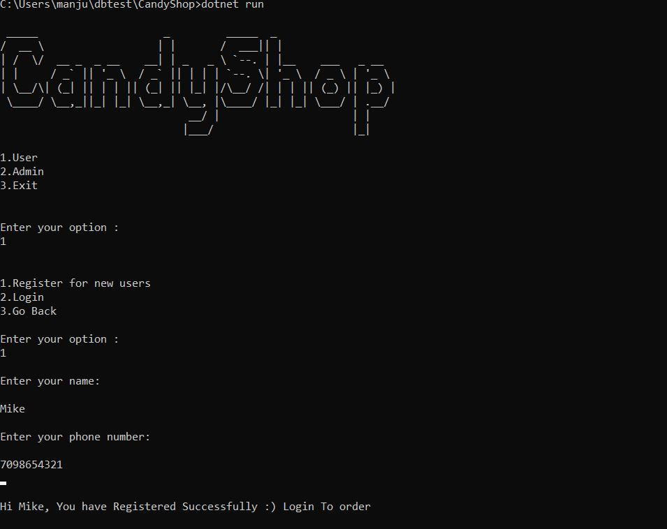
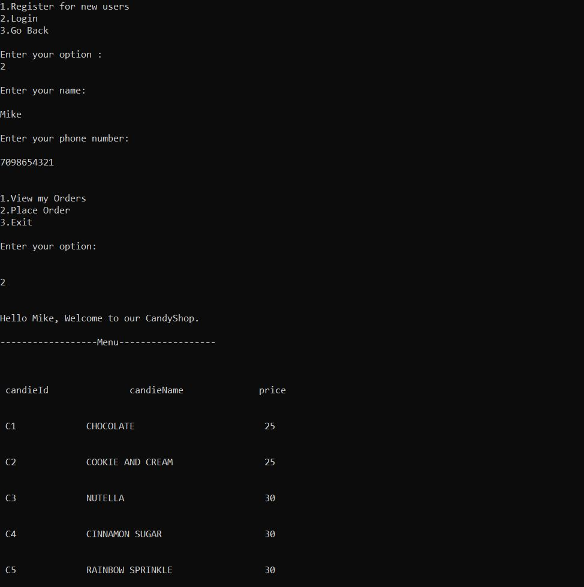
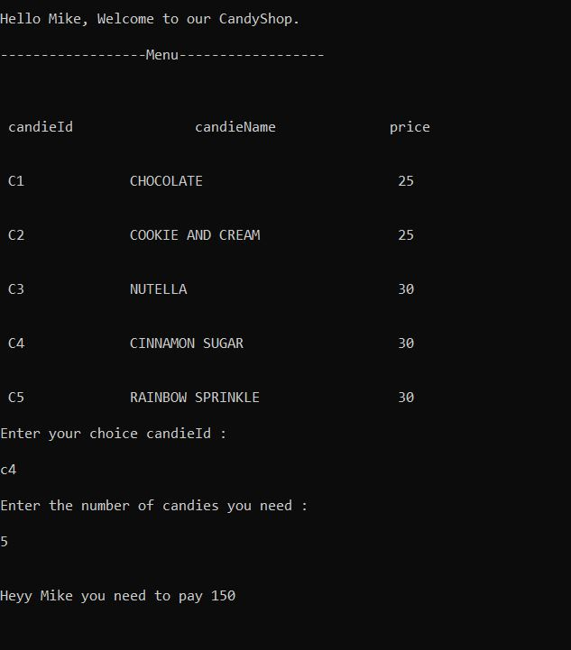
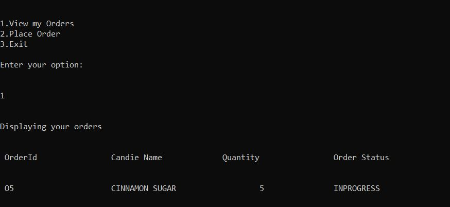
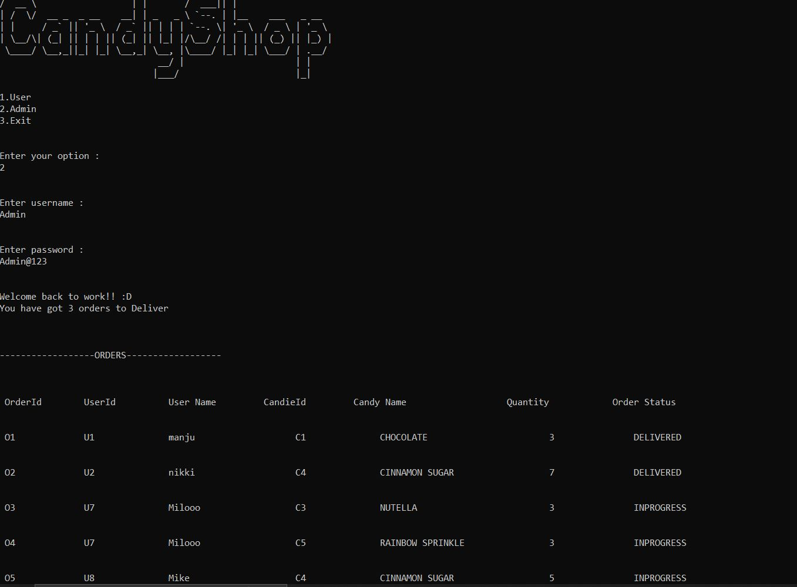
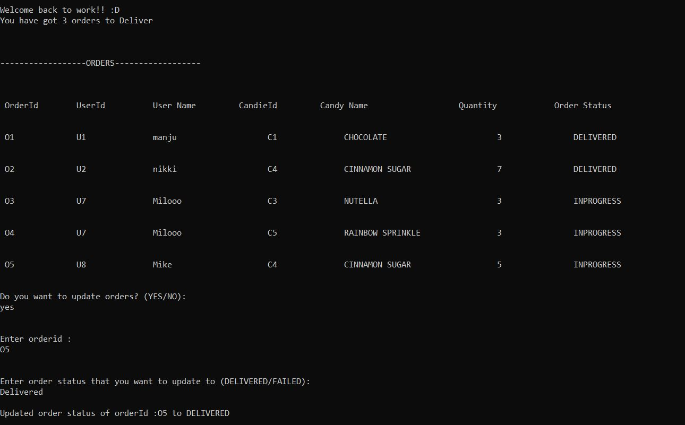
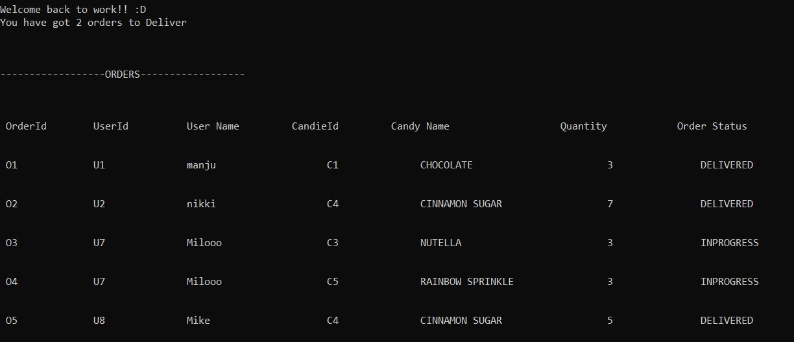

# CANDYSHOP-V0.0 
### CandyShop-v0.0 is a console application with database connection, using C# and ADO.NET.

## TEAM-MATES              
[MANJUSHREE PANTHANGI](https://gitlab.com/Manjushree_Panthangi) 

[U. NAGA SAI NIKHITHA](https://gitlab.com/Nikhitha1902)

[MAITHILEE DOLHARKAR](https://gitlab.com/maithileedol478)

[VEERABATULA SAI KEERTI](https://gitlab.com/keerti_2002)

## OBJECTIVE
### To develop a console application with database connection in the theme of candyshop, which has a Customer (one who can place candie orders) and an Admin (who can view all orders and can serve the orders).

## SOFTWARE REQUIREMENTS

[**Visual Studio Code**](https://code.visualstudio.com/)

[**Dotnet**](https://dotnet.microsoft.com/en-us/)

[**C# Extension**](https://marketplace.visualstudio.com/items?itemName=ms-dotnettools.csharp)

**SQL Server Extension for Visual Studio Code**

[**SQL Express Edition**](https://www.microsoft.com/en-in/sql-server/sql-server-downloads)

## SETUP AND RUN INSTRUCTIONS

1. As a prerequisite you need to have all the software requirements intsalled on your system.
2. You need to setup the SQL server in visual studio using the SQL express edition's connection string.
([**FOLLOW THIS VIDEO FOR REFERENCE**](https://www.youtube.com/watch?v=VDn8e1JgSiA))
3. Clone the repository and change the branch and pull.

**Commands to run**
### `git clone https://gitlab.com/pgb2022q3/dotnet/dbtest.git`

### `git checkout -b CandyShop-v0.0`

### `git pull origin CandyShop-v0.0`

4. Now run the SQL Script for database creation and tables creation.

--> Go to dbScript 

--> Run dbCreationSQLScript.sql

--> Run tableCreationSQLScript.sql

--> Run CandiesMenuSQLScript.sql

5. Open Command prompt and run commands.

### `cd dbtest\CandyShop`

### `dotnet run`
 
and you are ready to order from our shop :)

### Admin Credentials 
### User Name : Admin 
### Password  : Admin@123

## Functionalities
### Roles
1. User
2. Admin

# **User/Customer** :
### 1. Registeration

### 2. Login

### 3. Place order

### 4. View my orders

# **Admin** :
### 1. Login and 2. View all orders

### 3. Update order status

